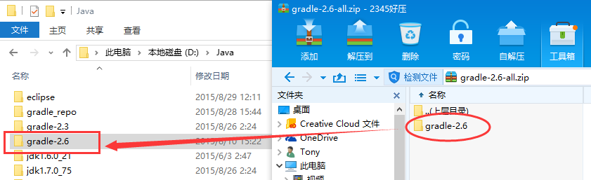
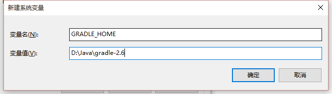
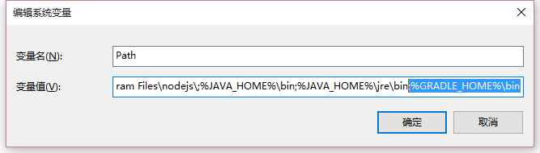
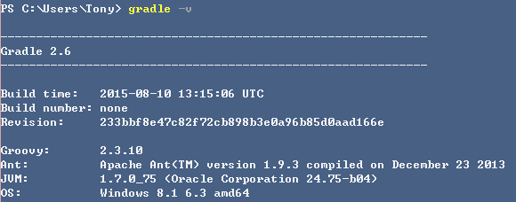
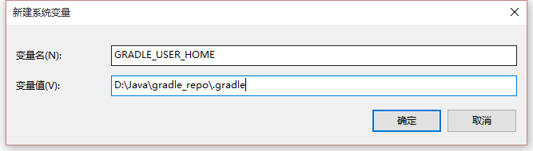

[[gradle-setup]]
= Gradle 的安装与配置
2015年9月1日 14:05

Gradle 是以 Groovy 语言为基础，面向Java应用为主。基于DSL（领域特定语言）语法的自动化构建工具。

Gradle 官网 http://gradle.org

Gradle 百度词条 http://baike.baidu.com/view/9916271.htm

[[gradle-download]]
== Gradle的下载
可以从gradle官网获得最新版本的gradle下载，这里是当前版本gradle 2.6的下载链接 https://services.gradle.org/distributions/gradle-2.6-all.zip

[[gradle-setup-on-windows]]
== Windows下Gradle的安装与配置
Gradle的安装非常简单，只需要解压压缩包到指定目录并配置正确的环境变量即可。gradle使用前需要安装JDK1.6（或更高版本的JDK）并正确配置环境变量 JAVA_HOME。Gradle安装步骤如下：

1. 将下载的程序包解压到指定目录

.解压安装包

2. 添加环境变量 `GRADLE_HOME=[gradle安装根目录]`

.新建GRADLE_HOME环境变量

3. 编辑环境变量 Path，在末尾加上 `;%GRADLE_HOME%\bin`

.修改path环境变量

4. 检查安装配置是否正确生效。新打开一个“命令提示符”窗口，输入gradle版本检查命令 `gradle -v` ，正确输出配置的gradle版本信息，说明安装配置正确。

.输出gradle版本

5. 由于在使用gradle的过程中，gradle将从中央仓库下载众多项目中使用的jar包并保存到当前用户的本地仓库中（默认当前用户文件夹下的 " `.gradle` " 目录），这对于C盘空间资源不是很富裕的Windows用户来说不是期望的结果，我们可以通过新建环境变量 `GRADLE_USER_HOME=[重新制定的gradle本地仓库路径]` 来重定向gradle的本地仓库位置，某些情况下需要注销当前用户重新登录后才会生效。

.重新制定的gradle本地仓库

