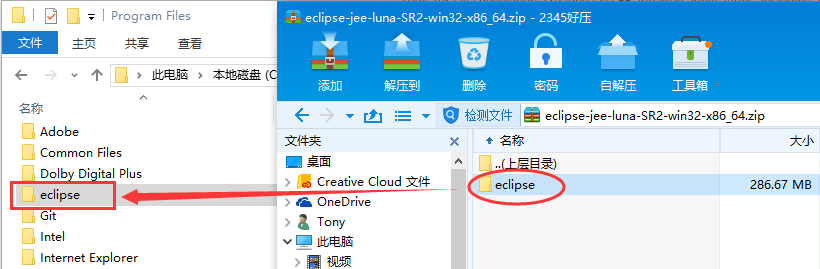
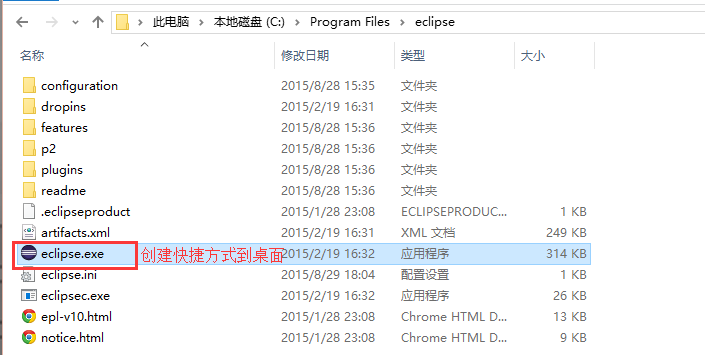
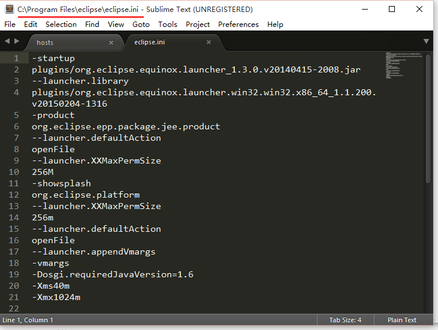
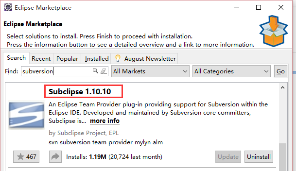
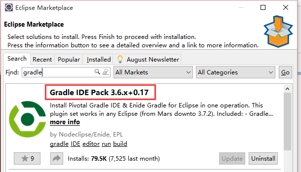
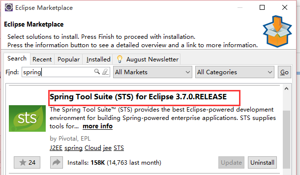

[[eclipse-setup]]
= Eclipse的安装与配置
2015年9月1日 14:05

Eclipse 官网 http://www.eclipse.org/

[[eclipse-downloads]]
== Eclipse的下载
Eclipse下载地址 http://www.eclipse.org/downloads/
当前Eclipse最新版是 Eclipse Mars (4.5) Release，我们安装的是 Eclipse luna (4.4) sr2 Packages http://www.eclipse.org/downloads/packages/release/luna/sr2

我们这里使用的Eclipse工具包集合是 *Eclipse IDE for Java EE Developers*

[[eclipse-setup-on-windows]]
== Windows下Eclipse的安装与配置
Windows下的eclipse安装很简单，将下载的包解压到指定目录，并将启动文件生成快捷方式到桌面或其他需要的目标地址即可。Eclipse的运行需要依赖于JDK1.6（或更高版本的JDK）。安装步骤如下：

1. 将下载的程序包解压到指定目录
+
.解压安装包

+
2. 将启动文件生成快捷方式到桌面
+
.创建快捷方式

+
3. 若系统资源足够，可以编辑 eclipse 根目录的eclipse.ini 文件，配置相应的启动参数以提高eclipse的运行效率。
+
.修改启动参数

[[eclipse-plugins-setup]]
== Eclipse插件安装（插件根据自己的需要选择安装）
纯净的eclipse或许不能完全满足我们开发需求，这时需要安装一些插件来支持我们的开发工作。Eclipse的插件安装方法有很多，常见的有3种途径：

  * 先下载好插件包文件，直接拷贝到Eclipse插件目录（最好是当前用户下的".eclipse"目录下的插件目录）
	* 通过"Help --> Install New Sorftware…" 菜单选项安装。该方法可以安装已下载好的插件包，或者指定插件包update路径下载安装
	* 通过"Help --> Eclipse Marketplace…" 菜单选项从Eclipse Market安装。

本文选择使用从Market安装的方式。

1. 安装SVN版本控制插件，在 Market 中搜索 "subversion" ,点击"Install" 安装
+
.安装SVN版本控制插件

+
2. 安装gradle插件，在 Market 中搜索 "gradle" ,点击"Install" 安装
+
.安装gradle插件

+
3. 安装spring插件，在 Market 中搜索 "spring" ,点击"Install" 安装
+
.安装spring插件STS

