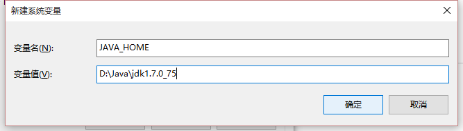
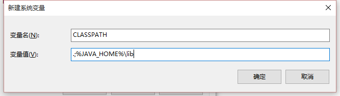
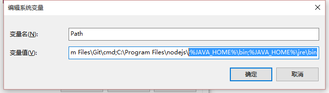

[[jdk-setup]]
= JDK的安装与设置

[[jdk-download]]
== JDK下载
最新版本（当前是JDK8.0）的下载地址是： http://www.oracle.com/technetwork/java/javase/downloads/index.html 。
可以从Oracle的Java Product Archive（Java 产品归档 http://www.oracle.com/technetwork/java/javase/archive-139210.html ）中找到历史版本的JDK文档和下载。

[[jdk-setup-on-windows]]
== Windows下JDK的安装与配置
如果从官网上下载的是 jdk-*-windows-*.exe 的程序安装包，直接双击运行安装即可，安装时默认就会进行相关的环境变量的配置。如果是从其他工具包中拷贝的JDK环境，则需要做一些环境变量的配置（Windows环境变量配置方法），配置步骤如下：

1. 新建环境环境变量`JAVA_HOME=[JDK安装根目录]`
+
.新建JAVA_HOME环境变量

2. 新建环境变量`CLASSPATH=.;%JAVA_HOME%\lib`
+
.新建CLASSPATH环境变量

3. 编辑环境变量`Path`，在末尾加上 "`;%JAVA_HOME%\bin;%JAVA_HOME%\jre\bin`"，若之前有安装JDK，并且没有卸载或清除，请注意在Path环境变量中找到相应的变量值做修改或删除，以免冲突。
+
.修改path环境变量

4. 测试JDK环境变量设置是否正确生效。新打开一个“命令提示符”窗口，输入Java版本检查命令 "`java -version`"，正确输出配置的JDK版本信息，说明安装配置正确。
+
.输出当前java版本

[[jdk-setup-on-linux]]
== Linux 下JDK的安装与配置

`//TODO: 待完善`
