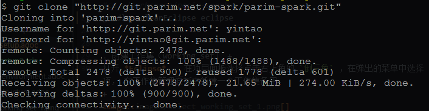
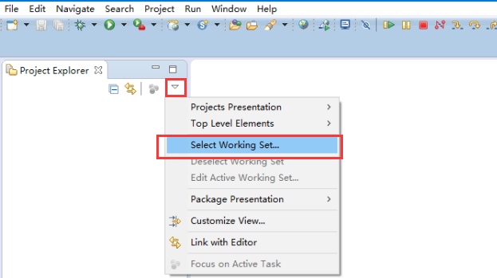
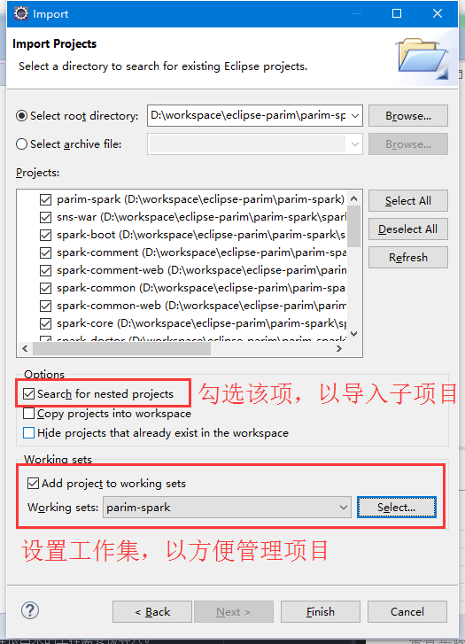

[[guide-how-to-setup]]
= 初始化项目

在项目初始化之前，你需要安装 [开发环境准备](http://git.parim.net/spark/parim-spark/wikis/environment) 中要求的相关工具。其中必要的工具包括 `JDK` 、 `Eclipse` 、 `Git` 、 `Tomcat` 。

== 操作步骤

. 检出项目 +
用命令行工具进入到你的 *workspace* ， 然后用 `git clone` 命令检出工程。
+
[source,shell]
----
#cd ~/workspace
git clone "http://git.parim.net/spark/parim-spark.git"
----
+

. 生成IED项目并导入到Eclipse +
可以运行工程根目录中的 `import-into-eclipse.sh` 或 `import-into-eclipse.bat`，按照指示的步骤导入共到Eclipse。如果你选择此方法导入，可以跳过此文中后面的第3-5项，进入第7项，否则请按照下面的步骤操作。
+
[NOTE]
需要注意的是，如果你本机安装了Gradle，可以将命令 `gradlew` 替换成 `gradle`。另外，首次生成项目时，可能需要较长的时间下载相关的依赖包，您需要耐心等待一段时间。

. 生成项目 +
进入工程根目录，并执行生成子项目工程命令。
+
[source,shell]
----
#cd ~/workspace/parim-spark
gradlew cleanEclipse eclipse
----

. 创建工作集（working set） +
打开 *Eclipse* ， 在项目面板选择点击右上角的 `倒三角` ，在弹出的菜单中选择 `Select Working set...` 菜单项， 在工作集管理面板中新建一个工作集备用。
+

+
[NOTE]
*Working set* 在工作空间中项目较多的情况下，可以辅助我们管理项目面板中的项目。

. 导入项目 +
打开 *Eclipse*，执行 `File` -> `import...` ->  `General` -> `Existing Projects into Workspace` -> `browse to ~/workspace/parim-spark` -> `Choose all projects` -> `Finish` 。
+

. 运行项目 +
在Eclipse项目视图中找到 `spark-war` 工程，右键点击-> `Run on server` 。
或者直接用Gradle插件运行 `:spark-web:tomcatRun` 或 `:spark-web:tomcatRunWar` 。
+
[NOTE]
开发阶段，运行的中间件需要支持 `Servlet 3.0`， Tomcat 要求 7.0及以上版本， Jetty 要求 9.0 及以上版本。

. 访问项目 +
本地访问地址:: http://localhost:8080/spark-war/
+
用户名/密码:: admin/admin
