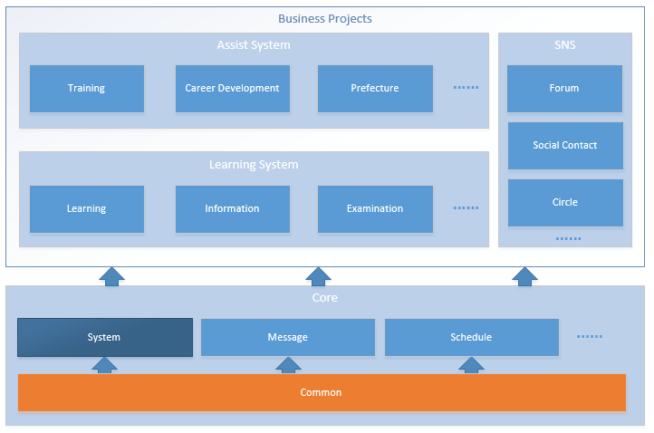

[[guide-project-structure]]
= 项目结构

[[guide-project-structure-dir-and-files]]
== 目录和文件

[[gps-dir-root]]
=== 根目录
当从服务器下载文件到本地后，从源文件的根目录开始，你大概能看到如下的目录结构。

[source, shell]
----
# parim-spark/ $ tree -L 1
.
├── build                          <1>
├── build.gradle                   <2>
├── buildSrc                       <3>
├── CHANGELOG                      <4>
├── gradle
├── gradle.properties
├── gradlew
├── gradlew.bat
├── import-into-eclipse.bat        <5>
├── import-into-eclipse.sh         <5>
├── import-into-idea.md
├── README.md                      <6>
├── settings.gradle
├── spark-core                     <7>
├── spark-war                      <8>
└── src                            <9>
----
<1> 根项目编译目标目录。该目录需要在编译项目后才会生成。
<2> Gradle项目构建配置文件。该文件管理了整个项目的构建配置、jar包依赖以及各个子项目之间的依赖关系。
<3> 构建脚本源文件目录
<4> 更新日志。按里程碑或者项目重要版本为单位记录，记录包含版本信息、更新记录描述及更新项列表和索引。
<5> 导入到IED(Eclpse)的向导脚本，一般在本地开发初始化项目的时候使用。
<6> 关于文件。这个文件对项目有个简单的概述，并包含部分重要文档索引，以指导如何使用本项目。
<7> [*打包项目*]核心功能打包项目。该项目是个空项目，仅用于打包几个核心项目（ `spark-common` + `spark-templates` + `spark-system` + `spark-gengerator` ），以简化依赖配置。
<8> [*打包项目*]WEB属性打包项目。打包整个工程为web工程，用于部署和发布。该项目理论上依赖于其他所有子项目。
<9> 根项目源文件目录。该项目包含部分编译依赖配置文件，以及项目文档。 +
    `TODO:项目文档是否考虑作为单独的子项目或者分布到各个子项目中`

[[gps-spark-core-files]]
=== spark-core子项目文件
[source, shell]
----
# parim-spark/ $ tree spark-core -L 1
./spark-core                      <1>
├── build.gradle                  <2>
├── README.md                     <3>
├── spark-common                  <4>
├── spark-common-web              <5>
├── spark-generator
├── spark-generator-web
├── spark-system                  <6>
└── spark-system-web              <7>
----
<1> spark-core 项目是 parim-spark 项目的核心项目，打包了一组技术核心项目和基础业务项目。为上层业务系统开发提供服务。
<2> spark-core 项目编译脚本。
<3> spark-core 项目说明文档。
<4> [*子项目*]通用项目。该项目提供项目开发的公共组件、工具。其他项目一般直接或间接依赖此项目。
<5> [*子项目*]通用项目web层，该项目提供一组通用的web层技术架构、组件、工具和文件结构公约。其他web项目一般直接或者间接依赖次项目，以保证编码和UI风格的统一。
<6> 系统业务基础服务模块。包含人员组织、角色权限、系统配置等基础功能服务。
<7> 系统业务基础服务模块管理界面。

[[gps-spark-common-files]]
=== spark-common子项目文件
common 项目可以理解为技术架构整合项目，包含基础的技术架构及其整合方案结构配置和一组作为默认值的属性配置。common-web 项目则约定了web项目的View（即jsp文件）的相关结构和文件路径和命名等相关开发约定，并提供了一组默认的UI Theme和系统标签工具。以下是两个子项目的文件结构介绍：

[source, shell]
----
# parim-spark/ $ tree spark-core/spark-common
./spark-core/spark-common
├── build.gradle
├── lib                                     <1>
└── src                                     <2>
    ├── main                                <3>
    │   ├── java                            <4>
    │   │   └── net/parim/common            // 公共项目代码java包路径
    │   │       ├── persistence             // 持久层相关基础类
    │   │       ├── ...
    │   │       ├── security                // 安全相关辅助类
    │   │       ├── service                 // service公共接口定义
    │   │       └── utils                   // 公共工具类
    │   └── resources                       <5>
    │       ├── db                          <6>
    │       ├── messages                    <7>
    │       ├── cache                       // 缓存相关结构配置文件
    │       ├── schedule                    // 任务调度相关结构配置文件
    │       ├── security                    // 安全相关结构配置文件
    │       ├── application.properties      <8>
    │       ├── applicationContext.xml      <9>
    │       ├── applicationContext-common.xml       <10>
    │       ├── log4j.properties            // 代码日志属性配置文件
    │       ├── mybatis-config.xml          // MyBatis结构配置文件
    │       └── spring-mvc.xml              <11>
    └── test                                <12>
        ├── java
        │   └── net/parim/common            <13>
        └── resources
----
<1> 第三方依赖包目录，被gradle管理Eclipse的classpath，存放在maven库中不能被找到或者镜像存在问题的jar包，比如 oracle14.jar。 +
`//TODO:今后可能废除该目录，将这些jar包放入公司的私有maven库中`
<2> 项目源文件目录，该目录不作为 Eclipse 直接的 `Source Folder`
<3> 可发布的项目源文件
<4> 用于存放 java 源文件
<5> 用于存放资源文件，如配置文件、Mybatis的Mapper文件、数据库脚本文件等。
<6> 数据库脚本存放目录
<7> 国际化消息属性配置文件存放目录，`这和VIEW相关，可能会考虑重构到*-web项目中`
<8> 系统属性配置文件
<9> spring 应用结构配置文件
<10> 本项目（common）spring 应用结构配置文件
<11> Spring MVC 配置文件，`TODO: 拟在后期整理到common-web子项目中`
<12> 测试相关代码和资源，该目录中的所有代码和资源只在测试阶段生效，在gradle编译过程中会自动调用拟好的测试代码，并作为编译是否成功的依据。测试代码和资源不会被打包到jar或者war包中。
<13> 测试代码的java 包结构一般和测试对象的包结构保持一致，并按照测试对象的名称命名相应的类和方法。

[source, shell]
----
# parim-spark/ $ tree spark-core/spark-common-web
./spark-core/spark-common-web
├── build.gradle
└── src
    ├── main
    │   ├── java
    │   │   └── net/parim/common            // 公共项目代码java包路径
    │   │       ├── api                     <1>
    │   │       └── web                     <2>
    │   └── resources
    │       ├── messages                    <3>
    │       └── META-INF                    <4>
    │           ├── resources               <5>
    │           │   ├── static              <6>
    │           │   └── WEB-INF
    │           │       ├── layouts         <7>
    │           │       ├── tags            <8>
    │           │       ├── tlds
    │           │       ├── views           <9>
    │           │       └── decorators.xml  <10>
    │           └── web-fragment.xml        <11>
    └── test                                <12>
        ├── java
        │   └── net/parim/common
        └── resources
----
<1> HTTP接口
<2> Spring MVC Controller 文件
<3> 国际化消息资源文件目录
<4> JEE标准项目描述信息目录
<5> WebFragment 项目的web资源文件，可以当成普通web项目的的WebRoot、WebContent或者src/mian/webapp目录
<6> 公共静态文件目录，如stylesheet、JavaScript、images等
<7> SiteMash 布局文件目录
<8> 通用工具标签文件目录
<9> 视图目录，用于存放业务相关的JSP视图文件，这些文件按照业务模块或者项目划分子目录
<10> SiteMash 布局配置文件
<11> WebFragment 配置文件，该文件等同于普通web项目的`web.xml`，仅有较小区别。
<12> 测试代码和资源目录，使用方法同common项目

/////
[[gps-spark-system-files]]
=== spark-system子项目文件
/////

[[gps-projects-ref]]
== 项目关系
=== 项目关系结构图

////
[[gps-module-management]]
== 模块组织
////
